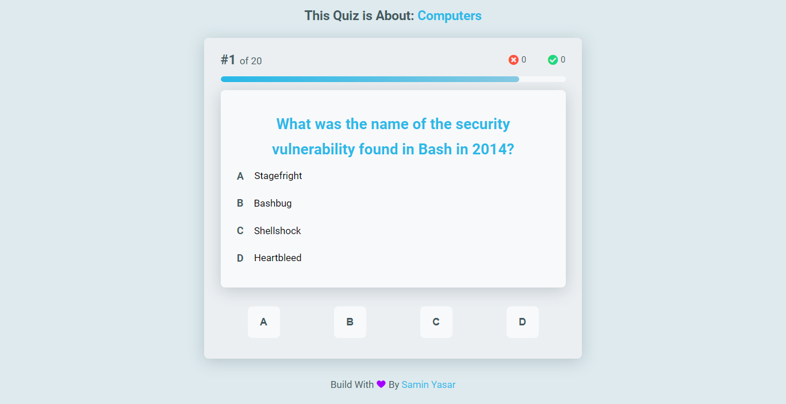

# **Trivia App**

This `Trivia App` will generate some questions about a bunch of random topic from [Open Trivia DB](https://opentdb.com/ "Open Trivia DB"). You can submit your answer and get the result!

## Table of Contents
1. [ Topics. ](#topics)
2. [ Configuration & Installation. ](#config)
3. [ Languages I used:. ](#langs)
4. [ Live Preview. ](#live)

<a name="topics"></a>
## Topics

```
- Nature
- Computers
- Mathematics
- Sports
- Animals
- Gadgets
```

<a name="config"></a>
## Configuration & Installation
1. Clone the repository
2. Open index.html in a browser
3. Enjoy the Game!

[](https://saminyasar.netlify.app/)
[](https://www.facebook.com/saminyasar004/)
[](https://www.facebook.com/saminyasar04/)
[](https://instagram.com/saminyasar004/)
[](https://twitter.com/saminyasar004/)
[](https://stackoverflow.com/users/14735945/samin-yasar)
[](https://github.com/saminyasar004/)



<a name="langs"></a>
## **Languages I used:**

```
-  HTML
-  CSS
-  JavaScript
```

<a name="live"></a>
## **Live Preview**

[Trivia App](https://triviaapp.vercel.app/ "Trivia App")

### Happy Coding 🚀
